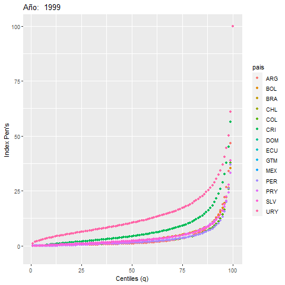

```{r setup, include=FALSE}
library(flexdashboard)
```

```{r,eval=F}
rm(list=ls())
library(dplyr)
library(sparklyr)
library(survey)
library(ggplot2)
library(convey)
conf <- spark_config()
  conf$`sparklyr.shell.driver-memory` <- "4G"
  conf$spark.memory.fraction <- 0.8 
sc <- spark_connect(master = "local", version = "2.4.3",config = conf)
#bid.csv es la base 
bd<-spark_read_csv(sc,path="C:\\Users\\ALVARO\\Desktop\\db_bolivia\\bid\\bid.csv",name="bid")
#bd<-spark_read_csv(sc,path="C:\\Users\\ALVARO\\Desktop\\db_bolivia\\bid\\bidsample.csv",name="bid")

country<-c("ARG", "BOL", "BRA", "CHL", "COL", "CRI", "DOM", "ECU", "GTM", "MEX", "PER", "PRY", "SLV", "URY")
mdiff<-matrix(NA,14,20)
mgini<-matrix(NA,14,20)
row.names(mdiff)<-country
colnames(mdiff)<-1999:2018

row.names(mgini)<-country
colnames(mgini)<-1999:2018

rc<-NULL
ry<-NULL
bdpen<-NULL
i<-1
for(k in 1999:2018){
  print(k)
  #k<-2018
aux<-bd %>% filter(anio_c==k) %>% select(pais_c,idh_ch,factor_ch,ipcm) %>% mutate(idh_ch=as.numeric(idh_ch),factor_ch=as.numeric(factor_ch),ipcm=as.numeric(ipcm)) %>% collect() 
aux<-aux[!is.na(aux$idh_ch),]
aux<-aux[!is.na(aux$factor_ch),]
#por país y año, diferencia p99/p01
for(j in 1:14){
    #j<-4
      aux2<-aux %>% filter(pais_c==country[j]) %>% group_by(idh_ch) %>% summarise(ipcm=max(ipcm),factor_ch=max(factor_ch))
      if(dim(aux2)[1]==0){
        next
      }
      sd1<-svydesign(id=~1,weights = ~factor_ch ,data=aux2)
      sd2<-convey_prep(sd1)
      a<-svyquantile(~ipcm,design=sd1,c(0.95,0.05),na.rm=T)[1]
      b<-svyquantile(~ipcm,design=sd1,c(0.95,0.05),na.rm=T)[2]
      c<-svygini(~ipcm,design=sd2,na.rm=T)
      if(b==0){
        mdiff[j,i]<-a
        rc<-c(rc,country[j])
        ry<-c(ry,k)
      } else {
        mdiff[j,i]<-a/b
      }
      #gini 
        mgini[j,i]<-c[1]
      #desfile de pen
      pen<-aux2 %>% mutate(qq=ntile(ipcm*factor_ch,100),index=ipcm*factor_ch) %>% group_by(qq) %>% summarise(index=sum(index))
      pen$index<-(pen$index/max(pen$index))*100
      pen$year<-k
      pen$pais<-country[j]
      bdpen<-rbind(bdpen,pen)
    }
i<-i+1
}
#mdiff a data frame
mdiff<-as.data.frame(mdiff)
colnames(mdiff)<-paste0("y.",colnames(mdiff))
mdiff$pais<-rownames(mdiff)
mdiff<-reshape(mdiff,idvar = "pais",direction="long",v.names = "y.",varying = list(1:20))

names(mdiff)<-c("pais","year","index")
mdiff$year<-1998+mdiff$year

#mdiff a data frame
mgini<-as.data.frame(mgini)
colnames(mgini)<-paste0("y.",colnames(mgini))
mgini$pais<-rownames(mgini)
mgini<-reshape(mgini,idvar = "pais",direction="long",v.names = "y.",varying = list(1:20))

names(mgini)<-c("pais","year","index")
mgini$year<-1998+mgini$year

save(mdiff,bdpen,mgini,file="bid.RData")
#ggplot(mdiff,aes(year,index))+geom_line(aes(color=pais))+ylim(5,50)
spark_disconnect(sc)
```

Introducción  {.sidebar}
===============================================================

### Fuente de datos

Base de datos del concurso:  "CONCURSO VISUALIZACION DESIGUALDAD.csv"


### Aclaraciones

* Para cada gráfico se considera los factores de expansión para cada año y país
* Los indicadores se generan a nivel de los hogares
* Las discontinuidades en las gráficas para algunos países se debe a la ausencia de información para ese año.
* Para el cociente de los centiles 95/5, no se muestran todos los valores, se presentan únicamente los del rango de 0 a 200.

### Index Pen's

Es la suma de la variable ipcm por centil ($q$) dividido entre la suma máxima entre los centiles (medida relativa escalada a %).

$$I_{Pen's,q}=\frac{\sum ipcm_q}{max(\sum ipcm_q)}*100$$

Principal
===============================================================

```{r}
library(ggplot2)
library(dplyr)
library(plotly)
library(gganimate)
```

Column
---------------------------------------------------------------

### Desfile de Pen's  (Dinámico)

```{r,eval=F}
load(url("https://github.com/AlvaroLimber/bid_vis/raw/master/bid.RData"))
ggplot(bdpen,aes(qq,index))+geom_point(aes(color=pais))+xlab("Centiles (q)")+ylab("Index Pen's")+transition_time(year)+labs(title = 'Año:  {frame_time}') 

#ggplot(bdpen ,aes(qq,index))+geom_point(aes(color=pais))+xlab("Centiles (q)")+ylab("suma(ipcm_q)/max(suma(ipcm_q))")+transition_time(year)
anim_save("C:\\Users\\ALVARO\\Documents\\GitHub\\bid_vis\\pen.gif")
```



### Desfile de Pen's, 2018

```{r}
load(url("https://github.com/AlvaroLimber/bid_vis/raw/master/bid.RData"))
p1<-ggplot(bdpen %>% filter(year==2018),aes(qq,round(index,2)))+geom_point(aes(color=pais))+xlab("Centiles")+ylab("Index Pen's") + theme(legend.title=element_blank())
ggplotly(p1)
```

Column
---------------------------------------------------------------

### Cociente entre centil 95 y 5. Años 1999 - 2018
```{r}
p2<-ggplot(mdiff,aes(year,round(index,2)))+geom_point(aes(color=pais))+facet_wrap(~pais,ncol=3)+ylim(0,200)+ theme(legend.position = "none")+ylab("c95/c5")+xlab("Año")
ggplotly(p2)
```

Column
---------------------------------------------------------------

### Gini. 1999 - 2018
```{r}
#p2<-ggplot(mdiff,aes(year,index))+geom_point(color="darkblue")+facet_grid(~pais)+ylim(5,100)
#ggplotly(p2)
p2<-ggplot(mgini,aes(year,index))+geom_line(aes(color=pais))+ylim(0.4,0.75)+ylab("Gini")+xlab("Año")+ theme(legend.title=element_blank())
ggplotly(p2)
```
